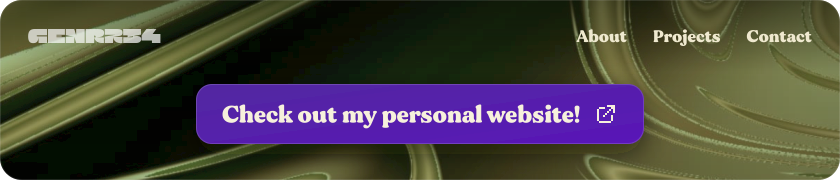
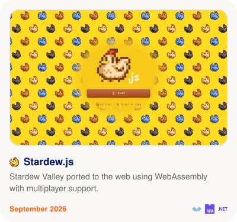
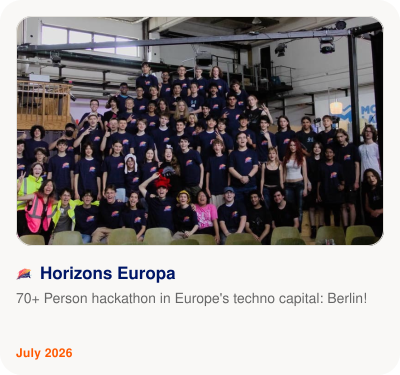
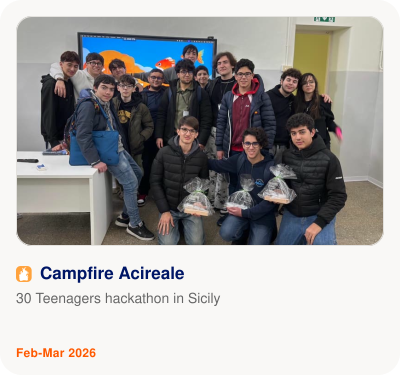
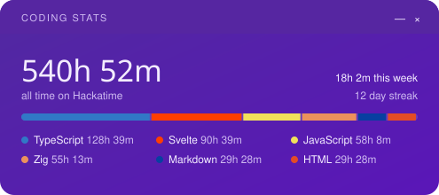

    
     
    
      
    
<!-- PROJECTS:START -->
<h3><picture><source media="(prefers-color-scheme: dark)" srcset="./assets/icons/code-dark.svg"></picture> Coding</h3>

<h3><picture><source media="(prefers-color-scheme: dark)" srcset="./assets/icons/users-dark.svg"></picture> Hackathons</h3>

<!-- PROJECTS:END -->
     
    

